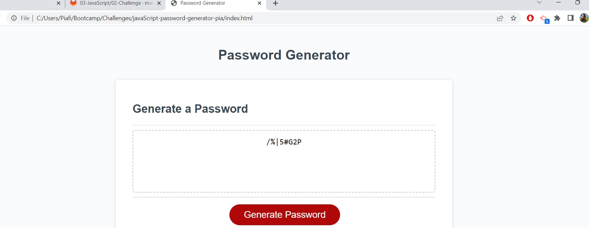

# JavaScript: Password generator-Pia-project

## User Story

```
As a full stack developer bootcamp student, simulating I am an employee with sensitive data,
I WANT to randomly generate a password that meets certain criteria
So I can create a strong password that provides with greater security
So I can demostrate my JavaScript learning
```
## Acceptance Criteria

```
Given I need a new, secure password
WHEN I click the button to generate a password
THEN I am presented with a series of prompts for password criteria
WHEN prompted for password criteria
THEN I select which criteria to include in the password
WHEN prompted for the length of the password
THEN I choose a length of at least 8 characters and no more than 128 characters
WHEN asked for character types to include in the password
THEN I confirm whether or not to include lowercase, uppercase, numeric, and/or special characters
WHEN I answer each prompt
THEN my input should be validated and at least one character type should be selected
WHEN all prompts are answered
THEN a password is generated that matches the selected criteria
WHEN the password is generated
THEN the password is either displayed in an alert or written to the page
```
### Screenshot of deployed application

> 

### Link to deploy application

> [https://pia-fierro.github.io/javaScript-password-generator-pia/](https://pia-fierro.github.io/javaScript-password-generator-pia/)


